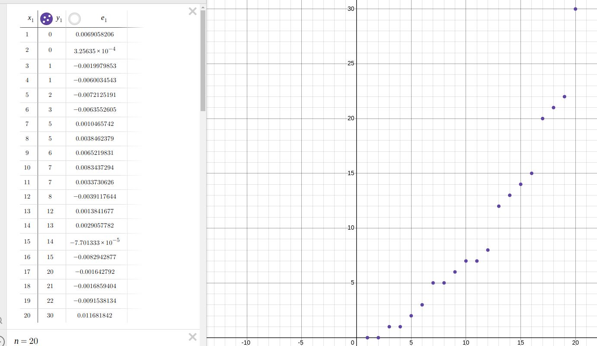
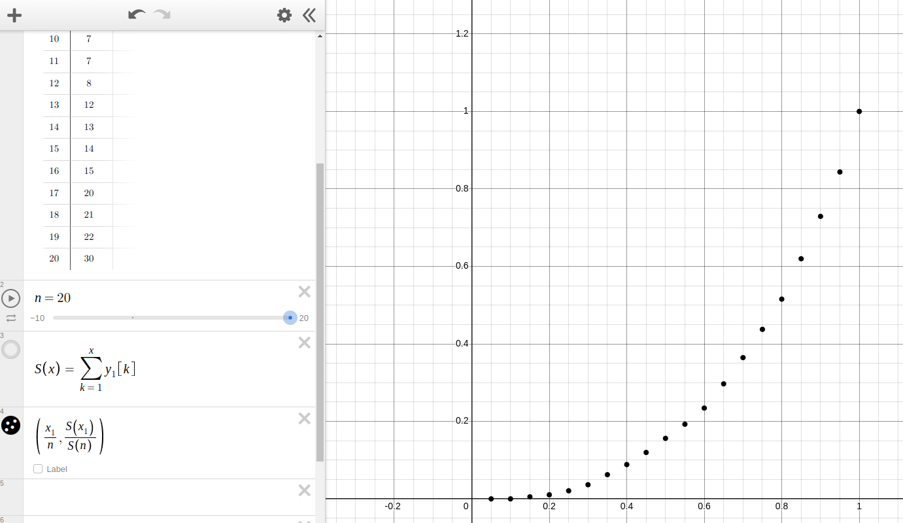
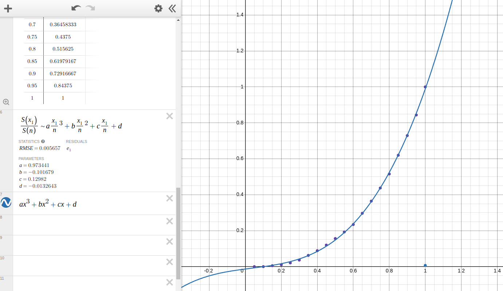
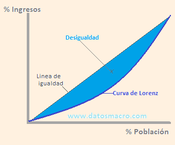
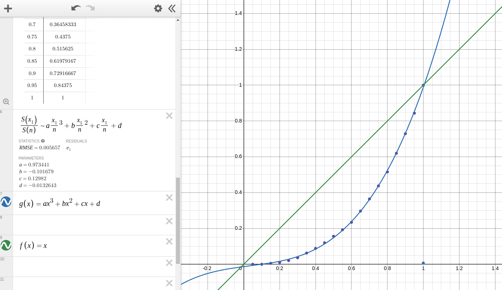

# Extracción de estadísticas ASISBIOM

En el proyecto proponemos un sistema de asistencia electrónico, lo que presenta las siguientes ventajas:

* Conteo exacto de asistencias
* Horario de entrada y salida exactos de los alumnos
* Información de tardanzas
* Entre otros

Aprovechamos esto haciendo un recuento de estadísticas para visualizar más fácilmente la información tomada por el sensor.

## Porcentaje de asistencias

El total de inasistencias de $n$ alumnos es la suma de las inasistencias 

$$
I_n = \sum_{k=1}^{n} I_k 
$$

donde $I_k$ es la inasistencia del alumno $k$. Un ciclo lectivo tiene (aproximadamente) 190 días de clase. Definimos $C$ como la cantidad de días hábiles. La cantidad de asistencias es 

$$
K_a = n \cdot C - I_n
$$

que sería la cantidad total de días hábiles por cada alumno, menos la suma de inasistencias. Entonces, el porcentaje de asistencias es

$$
\%A = \left( \frac{K_a \cdot 100}{n \cdot C} \right)
$$

Suponiendo que cada alumno tiene 10 inasistencias en la escuela, si un ciclo lectivo tiene 190 días hábiles y hay 500 alumnos, entonces:

$$
K_a = n \cdot C - I_n = 500 \cdot 190 - 500 \cdot 10 = 90,000
$$

$$
\%A = \left( \frac{90,000 \cdot 100}{95,000} \right) \approx 94.736842105
$$

## Porcentaje de tardanzas

De la misma manera, podemos calcular el porcentaje de tardanzas. Deje que 

$$
T_n = \sum_{k=1}^{n} T_k 
$$

sea la suma de todas las tardanzas. Análogamente podemos definir 

$$
K_t = K_a - T_n
$$

como la cantidad de asistencias puntuales sobre el total de asistencias. Entonces, el porcentaje de *puntualidad* es:

$$
\%P = \frac{K_t \cdot 100\%}{K_a}
$$

Para una escuela con 500 alumnos, suponiendo que cada alumno tiene 15 tardanzas, y la cantidad de asistencias total es la del ejemplo anterior (90,000) entonces:

$$
K_t = 90,000 - 15 \cdot 500 = 82,500
$$

$$
\%P = \frac{82,500 \cdot 100\%}{90,000} \approx 91.666666667
$$

Esto quiere decir que del total de asistencias, en el 91.7% los alumnos fueron puntuales. 

## Horario de llegada promedio
Para extraer el horario de llegada promedio, suponemos que tenemos un conjunto 

$$
H = \{h_{prom_1}, h_{prom_1}, h_{prom_3}, ... , h_{prom_n}\}
$$

donde $h_{prom_n}$ es el horario de llegada promedio del alumno $n$. Suponiendo que 

$$
h_{prom_n} =  \sum_{k=1}^{K_{a_n}} h_k
$$

donde $h_k$ es el horario de llegada del alumno $n$ y $K_{a_n}$ es la cantidad de asistencias del alumno. El promedio de los horarios de llegada es

$$h_{prom} = \frac{\sum_{n=1}^{t} h_{prom_n}}{t}$$

Esto nos daría el horario de llegada promedio (hay que tener en cuenta que el horario debe estar en un formato de número entero, por ejemplo, minutos $[m]$ desde las 00:00$[hs]$).

## Ordenamiento de alumnos por horario de llegada

Si definimos una función definida como la diferencia en el horario de llegada del alumno en el día respecto del horario de llegada esperado, llamémosla $h(t)$, donde $t$ se mide en días. La función nos da como salida la diferencia entre el horario de llegada esperado, y el horario de llegada real del alumno

$$
h(t) = H_{t} - H_{llegada}
$$

donde $H_t$ es el horario esperado de llegada en el día $t$. De esta manera, si el alumno llega tarde $h_ns(t) < 0$, si el alumno es puntual $h_ns(t)\approx0$ y si llega temprano $h_ns(t) > 0$.

Si suponemos que $h_ns(t)$ es continua y es derivable en $0 \leq t \leq K_{a_n}$, donde $K_{a_n}$ es el total de asistencias del alumno $n$. Entonces 

$$
I_h=\int_{0}^{K_{a_n}}{h_n(t)}dt
$$

es el índice de puntualidad del alumno. Para visualizar esto, podemos graficar una función cualquiera, entonces el área bajo la curva será positiva si el alumno llega temprano; si el alumno llega temprano la mitad de los días y el resto de los días llega tarde, entonces $I_h\approx0$; si el alumno llega tarde siempre, entones $I_h < 0$.

Como los datos que nosotros obtendremos no nos dan funciones continuas, y hacer una aproximación polinómica es incorrecto ya que la distribución de los horarios de llegada no es uniforme; optaremos por una suma que aproxime este valor:

$$
I_n \approx \Delta x \cdot \sum_{k=1}^{K_{a_n}}{h_n(k)}
$$

Donde $\Delta x = \frac{K_{a_n}}{C}$ donde $C$ es la cantidad de días hábiles en el ciclo lectivo.

La definición de $\Delta x$ es necesaria ya que, suponga que un alumno $a_1$ tiene $180$ asistencias, entonces el puntaje de este alumno debe ser mayor al de un alumno $a_2$ con $170$ asistencias. Entonces:

$$
\Delta x_{a_1} > \Delta x_{a_2}
$$

suponiendo que ámbos alumnos son igual de puntuales, el puntaje $I_1$ > $I_2$. En otras palabras, la calificación no solo se dará por puntualidad, sino que además por el número de asistencias totales.

Para ordenarlos bastaría con hacer una tabla donde utilizamos el valor de $I_n$ como índice.

### Distribución de puntualidad

En base a esto podemos graficar una curva de Lorenz.

Suponemos que tenemos una lista de valores, con alumnos de $1$ al $n$, ordenados en base a $I_n$ de menor a mayor, esto quiere decir que el alumno con el puntaje más bajo es el alumno 1, y así.

 
(los valores de $y_1$ corresponden $I_n$)

En este caso despreciamos valores negativos, suponiendo que todos los alumnos son puntuales o llegan tarde. Si tenemos valores negativos (alumnos que llegaron más temprano), transformaremos los valores de $y_1$ sumando $y_1 - S[1]$, siendo $S$ la lista de valores, solo si el primer valor es negativo.

Realizamos la sumatoria acumulada de los valores de $I_n$

$$
S_n = \sum_{k = 1}^{n}{I_k}
$$

si evaluamos la suma con $n = \{ 1, 2, 3, ..., n \}$ nos dará una lista $S$ de números corespondiente a la suma acumulada hasta el alumno $n$ de los valores de $I_n$

$$
S_1 = \sum_{k = 1}^{1}{I_k}
$$

$$
S_2 = \sum_{k = 1}^{2}{I_k}
$$

$$
S_3 = \sum_{k = 1}^{3}{I_k}
$$

$$
...
$$

$$
S_n = \sum_{k = 1}^{n}{I_k}
$$

luego dividimos la lista obtenida por el valor más alto de $I_n$. Si graficamos los puntos $( n, \frac{S}{S_n} )$  formarán la curva de Lorenz.

 

en la imagen representamos la suma como una función de x, donde x es el número de iteraciones en la suma. Podemos graficar los puntos en $0\leq x \leq1$ dividiendo el índice del alumno $x_1$ por  el número de elementos de la lista $n$.

Luego vamos a aproximar estos puntos, modelando una función cúbica.

 

Una curva perfectamente distribuida, es decir, cada alumno entra al mismo horario, se representaría con $f(x)=x$, o sea, una recta con pendiente $1$. Si revisamos la definición anteriormente dada, esto es cierto, ya que si tenemos una lista $l = \{1,1,1,1 ..., 1\}$, el resultado sería $r=\{ 1/n, 2/n, 3/n, ..., n/n \}$. Es decir, una función lineal entre 0 y 1.

La curva de Lorenz nos da información sobre la distribución de una variable. En este caso analizamos la diferencia del tiempo de llegada de los alumnos. La curva nos expresa el porcentaje de alumnos que llega a un porcentaje de esa diferencia de tiempo mencionada. Para explicarlo mejor, tenemos que la media de alumnos (50%) representada en $g(0.5)=0.147906270632$, esto quiere decir que el $50\%$ de los alumnos llega a un $14.7\%$ de la diferencia de horario más alta de la tabla (30 min.). En otras palabras, la media de los alumnos llega con $\approx4.437$ minutos de diferencia con respecto al horario máximo.

Podemos calcular la "desigualdad" existente entre los datos computados y una distribución perfecta, a continuación se explica cómo y qué significa.

### Cómo medir la puntualidad en una escuela

Es importante dentro de una institución la puntualidad de sus alumnos. Para analizar estos datos podemos hacer uso de varias técnicas. Anteriormente se observó la distribución de la diferencia en los horarios de llegada de los alumnos. Por si solo esto nos dice el porcentaje de alumnos que llega a un porcentaje del horario de llegada, pero no nos vale para definir la puntualidad de la escuela. Para ello vamos a necesitar varios datos, la curva de Lorenz, el índice de Gini y por último, los horarios de llegada reales de los alumnos, o al menos la diferencia del horario de llegada y el real.

#### Índice de Gini

El índice de Gini compara la curva de Lorenz que generamos, con una distribución perfecta, lo que hacemos es hallar el área entre la curva $f(x)$ y $g(x)$:

 

En esta imagen comparan los ingresos de una población, sin embargo vamos a investigar la desigualdad en los horarios de llegada de los alumnos. Por ejemplo, en una escuela que está bien ordenada, el total de alumnos debería llegar un horario similar, en este caso la curva se va a asemejar a la "línea de igualdad", mientras que en el caso de una escuela que tiene un porcentaje de alumnos que llega muy temprano y otro que llega muy tarde, le corresponde una curva más empinada. Es necesario aclarar que ésta curve no mide si una escuela es puntual o no, lo que nos indica es si los alumnos de dicha escuela llegan al mismo tiempo, es decir, si los alumnos llegan siempre tarde la curva será casi recta, y podemos pensar que la escuela tiene una buena puntualidad aunque esto no sea cierto. Por eso debemos comparar todos los datos, incluyendo sobre todo el promedio del horario de llegada, el cuál nos dará una condición para determinar la puntualidad de la escuela.

 

Continuando con lo anteriormente dicho, el índice de Gini nos sirve para medir la desigualdad, éste índice tiene un rango entre $0\leq x \leq 1/2$ ya que puede ser a lo más el área de un triángulo rectangulo cuyos catetos son 1 y su hipotenusa es $\sqrt{2}$, o cero.

Para calcular el índice de Gini hayamos el área entre $f(x)=x$ y $g(x)$ a través de una integral definida entre $0 < x < 1$.

$$
\int_{0}^{1}\left(f\left(x\right)-g\left(x\right)\right)dx
$$

$$
\int_{0}^{1}\left(x-g\left(x\right)\right)dx
$$

En base a nuestra aproximación:

$$
g\left(x\right)=ax^{3}+bx^{2}+cx+d
$$

$$
G=\int_{0}^{1}\left(x-g\left(x\right)\right)dx \approx 0.238886846345
$$

Entonces, el índice de Gini es aproximadamente $0.238886846345$.

La interpretación de éste resultado nos puede dar una pista. Como se menciona, no nos detalla en absoluto si los alumnos son puntuales, pero vamos a suponer que una escuela tiene una diferencia en el horario de llegada, en promedio, de 5 minutos de anticipacion. Ahora, en base a este dato, podemos calcular el índice de Gini, por ejemplo,  $G = 0.07$. En este caso se puede decir que la escuela es puntual ya que en promedio los alumnos llegan temprano, y además la distribución de sus horarios de llegada es bastante uniforme (una curva casi recta).

 
(Se aproximó el valor,  para $G=0.07$ habría menos diferencia)