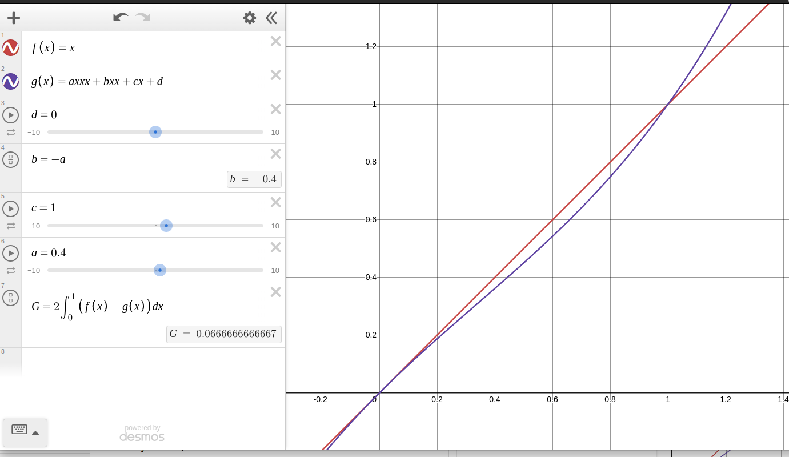

# Extracción de datos y estadísticas 
### **Escuela**: EETP N.612 "Eudocio de los Santos Giménez". Coronda, Santa Fe. 
### **Proyecto**: ASISBIOM (Asistencia Biométrica)
### **Autor**: Joaquín Gómez
### **Fecha de actualización** 03 - 08 - 2024
## **Índice**

- [Extracción de datos y estadísticas](#extracción-de-datos-y-estadísticas)
    - [**Escuela**: EETP N.612 "Eudocio de los Santos Giménez". Coronda, Santa Fe.](#escuela-eetp-n612-eudocio-de-los-santos-giménez-coronda-santa-fe)
    - [**Proyecto**: ASISBIOM (Asistencia Biométrica)](#proyecto-asisbiom-asistencia-biométrica)
    - [**Autor**: Joaquín Gómez](#autor-joaquín-gómez)
    - [**Fecha de actualización** 03 - 08 - 2024](#fecha-de-actualización-03---08---2024)
  - [**Índice**](#índice)
- [Introducción](#introducción)
- [Porcentaje de asistencias](#porcentaje-de-asistencias)
- [Porcentaje de tardanzas](#porcentaje-de-tardanzas)
- [Horario de llegada promedio](#horario-de-llegada-promedio)
- [Ordenamiento de alumnos por horario de llegada](#ordenamiento-de-alumnos-por-horario-de-llegada)
  - [Distribución de puntualidad](#distribución-de-puntualidad)
  - [Cómo medir la puntualidad en una escuela](#cómo-medir-la-puntualidad-en-una-escuela)
  - [Índice de Gini](#índice-de-gini)
- [Implementación técnica](#implementación-técnica)
  - [Tiempo de recopilación de datos](#tiempo-de-recopilación-de-datos)
  - [Autorización y acceso a la información](#autorización-y-acceso-a-la-información)
- [Aclaraciones](#aclaraciones)

# Introducción

**En el proyecto proponemos un sistema de asistencia electrónico a través de datos biométricos (implementación con huella digital), el cual presenta las siguientes ventajas:**

* Conteo de asistencias automatizado.
* Exactitud en la extracción de horarios de entrada y salida.
* Automatización a la hora de la creación de planillas.
* Mejoras en el rendimiento de la escuela.
* Prevención de la falsificación o errores.
* Reducción de gastos relacionados a los medios tradicionales para contar asistencias, planillas, etc.
* Entre otras ventajas mencionadas en la documentación oficial.

Dentro de este documento se aprovechará una de las ventajas, que es el conocimiento de datos de entrada y salida de alumnos (horarios de llegada) para medir la puntualidad y rendimiento de la escuela en éste sentido.

# Porcentaje de asistencias

El total de inasistencias de $n$ alumnos es la suma de las inasistencias 

$$
I_n = \sum_{k=1}^{n} I_k 
$$

donde $I_k$ es la inasistencia del alumno $k$. Un ciclo lectivo tiene (aproximadamente) 190 días de clase. Definimos $C$ como la cantidad de días hábiles. La cantidad de asistencias es 

$$
K_a = n \cdot C - I_n
$$

que sería la cantidad total de días hábiles por cada alumno, menos la suma de inasistencias. Entonces, el porcentaje de asistencias es

$$
\%A = \left( \frac{K_a \cdot 100}{n \cdot C} \right)
$$

Suponiendo que cada alumno tiene 10 inasistencias en la escuela, si un ciclo lectivo tiene 190 días hábiles y hay 500 alumnos, entonces:

$$
K_a = n \cdot C - I_n = 500 \cdot 190 - 500 \cdot 10 = 90,000
$$

$$
\%A = \left( \frac{90,000 \cdot 100}{95,000} \right) \approx 94.736842105
$$

# Porcentaje de tardanzas

De la misma manera, podemos calcular el porcentaje de tardanzas. Deje que 

$$
T_n = \sum_{k=1}^{n} T_k 
$$

sea la suma de todas las tardanzas. Análogamente podemos definir 

$$
K_t = K_a - T_n
$$

como la cantidad de asistencias puntuales sobre el total de asistencias. Entonces, el porcentaje de *puntualidad* es:

$$
\%P = \frac{K_t \cdot 100\%}{K_a}
$$

Para una escuela con 500 alumnos, suponiendo que cada alumno tiene 15 tardanzas, y la cantidad de asistencias total es la del ejemplo anterior (90,000) entonces:

$$
K_t = 90,000 - 15 \cdot 500 = 82,500
$$

$$
\%P = \frac{82,500 \cdot 100\%}{90,000} \approx 91.666666667
$$

Esto quiere decir que del total de asistencias, en el 91.7% los alumnos fueron puntuales. 

# Horario de llegada promedio
Para extraer el horario de llegada promedio, suponemos que tenemos un conjunto 

$$
H = \{h_{prom_1}, h_{prom_2}, h_{prom_3}, ... , h_{prom_n}\}
$$

donde $h_{prom_n}$ es el horario de llegada promedio del alumno $n$. Suponiendo que 

$$
h_{prom_n} = \frac{\sum_{k=1}^{K_{a_n}} h_k}{K_{a_n}}
$$

donde $h_k$ es el horario de llegada del alumno $n$ y $K_{a_n}$ es la cantidad de asistencias del alumno. El promedio de los horarios de llegada es

$$h_{prom} = \frac{\sum_{k=1}^{n} h_{prom_k}}{n}$$

Esto nos daría el horario de llegada promedio (hay que tener en cuenta que el horario debe estar en un formato de número entero, por ejemplo, minutos $[m]$ desde las 00:00$[hs]$).

# Ordenamiento de alumnos por horario de llegada

Si definimos una función definida como la diferencia en el horario de llegada del alumno en el día respecto del horario de llegada esperado, llamémosla $h(t)$, donde $t$ se mide en días. La función nos da como salida la diferencia entre el horario de llegada esperado, y el horario de llegada real del alumno

$$
h(t) = H_{t} - H_{llegada}
$$

donde $H_t$ es el horario esperado de llegada en el día $t$. De esta manera, si el alumno llega tarde $h_ns(t) < 0$, si el alumno es puntual $h_ns(t)\approx0$ y si llega temprano $h_ns(t) > 0$.

Si suponemos que $h_ns(t)$ es continua y es derivable en $0 \leq t \leq K_{a_n}$, donde $K_{a_n}$ es el total de asistencias del alumno $n$. Entonces 

$$
I_h=\int_{0}^{K_{a_n}}{h_n(t)}dt
$$

es el índice de puntualidad del alumno. Para visualizar esto, podemos graficar una función cualquiera, entonces el área bajo la curva será positiva si el alumno llega temprano; si el alumno llega temprano la mitad de los días y el resto de los días llega tarde, entonces $I_h\approx0$; si el alumno llega tarde siempre, entones $I_h < 0$.

Como los datos que nosotros obtendremos no nos dan funciones continuas, y hacer una aproximación polinómica es incorrecto ya que la distribución de los horarios de llegada no es uniforme; optaremos por una suma que aproxime este valor:

$$
I_n \approx \Delta x \cdot \sum_{k=1}^{K_{a_n}}{h_n(k)}
$$

Donde $\Delta x = \frac{K_{a_n}}{C}$ donde $C$ es la cantidad de días hábiles en el ciclo lectivo.

La definición de $\Delta x$ es necesaria ya que, suponga que un alumno $a_1$ tiene $180$ asistencias, entonces el puntaje de este alumno debe ser mayor al de un alumno $a_2$ con $170$ asistencias. Entonces:

$$
\Delta x_{a_1} > \Delta x_{a_2}
$$

suponiendo que ámbos alumnos son igual de puntuales, el puntaje $I_1$ > $I_2$. En otras palabras, la calificación no solo se dará por puntualidad, sino que además por el número de asistencias totales.

Para ordenarlos bastaría con hacer una tabla donde utilizamos el valor de $I_n$ como índice.

## Distribución de puntualidad

En base a esto podemos graficar una curva de Lorenz.

Suponemos que tenemos una lista de valores, con alumnos de $1$ al $n$, ordenados en base a $I_n$ de menor a mayor, esto quiere decir que el alumno con el puntaje más bajo es el alumno 1, y así.

 
(los valores de $y_1$ corresponden $I_n$)

En este caso despreciamos valores negativos, suponiendo que todos los alumnos son puntuales o llegan temprano. Si tenemos valores negativos (alumnos que llegaron más tarde), transformaremos los valores de $y_1$ sumando $y_1 - S[1]$, siendo $S$ la lista de valores, solo si el primer valor es negativo.

Realizamos la sumatoria acumulada de los valores de $I_n$

$$
S_n = \sum_{k = 1}^{n}{I_k}
$$

si evaluamos la suma con $n = \{ 1, 2, 3, ..., n \}$ nos dará una lista $S$ de números corespondiente a la suma acumulada hasta el alumno $n$ de los valores de $I_n$

| Alumno     | Índice de puntualidad   |
|------------|-------------------------|
| 1          | $I_1$                   |
| 2          | $I_2$                   |
| ...        | ...                     |
| $k$        | $I_k$                   |

Donde $I$ es el Índice de puntualidad y $A$ es el alumno $n$, evaluando la suma:

$$
S_1 = \sum_{k = 1}^{1}{I_k}
$$

$$
S_2 = \sum_{k = 1}^{2}{I_k}
$$

$$
S_3 = \sum_{k = 1}^{3}{I_k}
$$

$$
...
$$

$$
S_n = \sum_{k = 1}^{n}{I_k}
$$

luego dividimos la lista obtenida por el valor más alto de $I_n$. Si graficamos los puntos $( \frac{k}{n}, \frac{S}{S_n} )$ para cada alumno $k$  formarán la curva de Lorenz.

La curva de Lorenz es la representación gráfica de la distribución de una variable de interés, como puede ser la renta o los ingresos, en una población, o en nuestro caso, la diferencia entre el horario de llegada de los alumnos y el horario de llegada estipulado. 

 

en la imagen representamos la suma como una función de x, donde x es el número de iteraciones en la suma. Podemos graficar los puntos en $0\leq x \leq1$ dividiendo el índice del alumno $x_1$ por  el número de elementos de la lista $n$.

Luego vamos a aproximar estos puntos, modelando una función cúbica.

 

Una curva perfectamente distribuida, es decir, cada alumno entra al mismo horario, se representaría con $f(x)=x$, o sea, una recta con pendiente $1$. Si revisamos la definición anteriormente dada, esto es cierto, ya que si tenemos una lista $l = \{1,1,1,1 ..., 1\}$, el resultado sería $r=\{ 1/n, 2/n, 3/n, ..., n/n \}$. Es decir, una recta a 45 grados. (Véase la figura 5 y 6).

La curva nos expresa el porcentaje de alumnos que llega a un porcentaje de esa diferencia de tiempo mencionada. Para explicarlo mejor, tenemos que el $50\%$ de alumnos, representad0 en $g(0.5)=0.147906270632$, esto quiere decir que el $50\%$ de los alumnos llega a un $14.7\%$ de la diferencia de horario más alta de la tabla (30 min.). En otras palabras, el $50\%$ de los alumnos llega con ~$4.437$ minutos de diferencia. En el caso analizado hay que tener en cuenta que ningún alumno llegaría tarde ya que los valores analizados de $I_n$ son positivos. En este caso la parte más *baja* de la curva representaría el porcentaje de alumnos que llega más tarde, ya que son los que tienen menor puntaje, la parte más *alta* son aquellos que tienen una puntuación más alta (llegaron más temprano).

Podemos calcular la "desigualdad" existente entre los datos computados y una distribución perfecta, a continuación se explica cómo y qué significa.

## Cómo medir la puntualidad en una escuela

Es importante dentro de una institución la puntualidad de sus alumnos. Para analizar estos datos podemos hacer uso de varias técnicas. Anteriormente se observó la distribución de la diferencia en los horarios de llegada de los alumnos. Por si solo esto nos dice el porcentaje de alumnos que llega a un porcentaje del horario de llegada, pero no nos vale para definir la puntualidad de la escuela. Para ello vamos a necesitar varios datos, la curva de Lorenz, el índice de Gini y por último, los horarios de llegada reales de los alumnos, o al menos la diferencia del horario de llegada y el real.

## Índice de Gini

El índice de Gini compara la curva de Lorenz que generamos, con una distribución perfecta, lo que hacemos es hallar el área entre la curva $f(x)$ y $g(x)$:

 

En esta imagen comparan los ingresos de una población, sin embargo vamos a investigar la desigualdad en los horarios de llegada de los alumnos. Por ejemplo, en una escuela que está bien ordenada, el total de alumnos debería llegar un horario similar, en este caso la curva se va a asemejar a la "línea de igualdad", mientras que en el caso de una escuela que tiene un porcentaje de alumnos que llega muy temprano y otro que llega muy tarde, le corresponde una curva más empinada. Es necesario aclarar que esta curva no mide si una escuela es puntual o no, lo que nos indica es si los alumnos de dicha escuela llegan al mismo tiempo, es decir, si los alumnos llegan siempre tarde la curva será casi recta, y podemos pensar que la escuela tiene una buena puntualidad aunque esto no sea cierto. Por eso debemos comparar todos los datos, incluyendo sobre todo el promedio del horario de llegada, el cuál nos dará una condición para determinar la puntualidad de la escuela.

 

Continuando con lo anteriormente dicho, el índice de Gini nos sirve para medir la desigualdad, éste índice tiene un rango entre $0\leq x \leq 1/2$ ya que puede ser a lo más el área de un triángulo rectangulo cuyos catetos son 1 y su hipotenusa es $\sqrt{2}$, o cero.

Para calcular el índice de Gini hallamos el área entre $f(x)=x$ y $g(x)$ a través de una integral definida entre $0 < x < 1$.

$$
G=2\cdot\int_{0}^{1}\left[f\left(x\right)-g\left(x\right]\right)dx=2\cdot\int_{0}^{1}\left[x-g\left(x\right]\right)dx

$$

En base a nuestra aproximación:

$$
g\left(x\right)=ax^{3}+bx^{2}+cx+d
$$

$$
G=2\cdot\int_{0}^{1}\left[x-g\left(x\right)\right]dx \approx 0.477773693
$$

Entonces, el índice de Gini es aproximadamente $0.477773693$.

La interpretación de éste resultado nos puede dar una pista. Como se menciona, no nos detalla en absoluto si los alumnos son puntuales, pero vamos a suponer que una escuela tiene una diferencia en el horario de llegada, en promedio, de 5 minutos de anticipacion. Ahora, en base a este dato, podemos calcular el índice de Gini, por ejemplo,  $G \approx 0.07$. En este caso se puede decir que la escuela es puntual ya que en promedio los alumnos llegan temprano, y además la distribución de sus horarios de llegada es bastante uniforme (una curva casi recta).

 
(Se aproximó el valor por debajo).

# Implementación técnica

La implementación de estos cálculos es bastante sencilla en el contexto de los lenguajes de programación actuales. El proyecto utiliza Java S.E junto con Spring Framework (como soporte para el backend), lo que nos va a permitir procesar los datos del lado del servidor.

Para la implementación de las funciones dentro de la aplicación habrá una clase llamada **StatsService.java** que se encargará de:
1.  Recopilar la información relacionada
2.  Ordenar los datos para su procesamiento
3.  Procesar los datos y guardarlos en la base de datos

Para implementar funciones matemáticas haremos uso de la clase **Math.java**. Los algoritmos a implementar son bastante sencillos ya que constan de sumatorias. Se proporcionará una representación en formato JSON para que el frontend pueda representar los datos gráficamente.

Cuando el usuario desee consultar estos datos simplemente accederá a un método definido en el controlador **StatsController.java**. Es necesario destacar lo siguiente:

## Tiempo de recopilación de datos

Tenemos que tener en cuenta que para poder obtener esta información necesitaremos un período de tiempo en el cual estos datos se consigan. La implementación que se llevará a cabo no procesará lo datos diariamente, sino que fijará una fecha la cual será a 30 días de haber registrado una nueva entrada en el servicio de estadísticas. El servicio de estadísticas estará disponible dentro de la aplicación principal como un panel de control, para poder acceder al servicio deberá entrar al panel con una cuenta de **DIRECTIVO** y habilitarlo. Cabe destacar que no obtendrá los datos hasta pasado un período de 30 días.

Los datos a procesar serán acumulados en el período lectivo y serán reiniciados luego del mismo (usted tendrá un registro de los datos que se han conseguido durante ciclos lectivos anteriores, sin embargo no serán modificados una vez que hayan finalizado). El control de los datos es responsabilidad de la aplicación; dentro de éste documento se presentan los métodos que serán utilizados para procesarlos y a los que podrá acceder, además se le proporcionarán datos específicos de cada alumno dentro del ámbito escolar.

## Autorización y acceso a la información

Ningún cargo menor a **SECRETARIO** o **DIRECTIVO** tendrá acceso a las métricas mencionadas, pero esto no significa que la información no pueda ser compartida, sino que por motivos de cada escuela es posible que solo estos cargos quieran o puedan visualizarlos.

# Aclaraciones
Es necesario aclarar que este documento es informal. Dentro del mismo se presentan distintas formas y conceptos que pueden utilizarse para conocer mejor a las instituciones de las que formamos parte. Además, las ideas comentadas caben dentro del contexto del proyecto como una forma de mejorar la institución educativa; ayudar a recopilar, analizar y comprender su comportamiento; como también facilitar el trabajo de aquellos individuos que trabajan con la información que el actual proyecto utiliza como medio de acción. En la documentación y presentación del proyecto damos a entender los objetivos y los medios para lograrlos, este documento es una rama de la documentación principal dedicada especialmente al manejo de los datos que recibimos y que merece destacarse debido a que es una de las ventajas principales del proyecto.